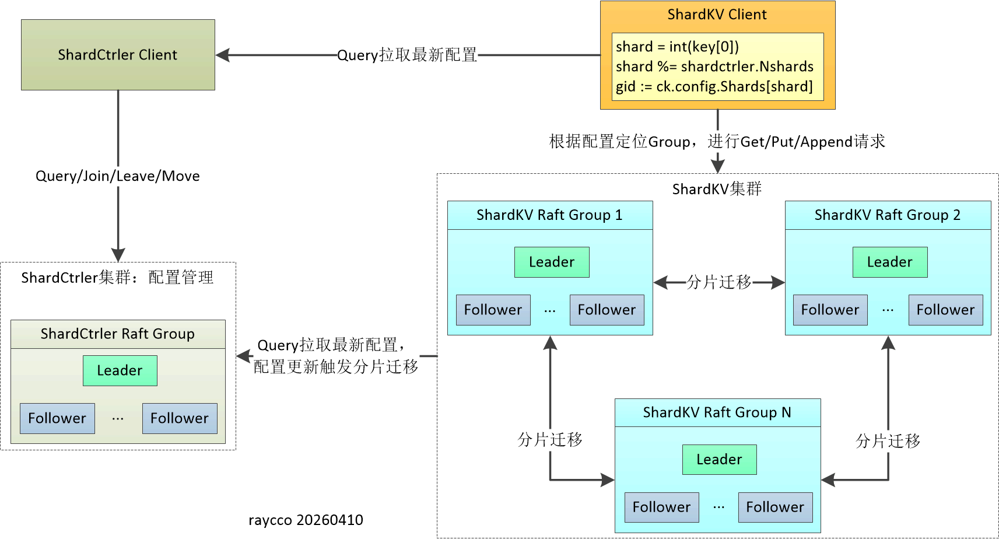
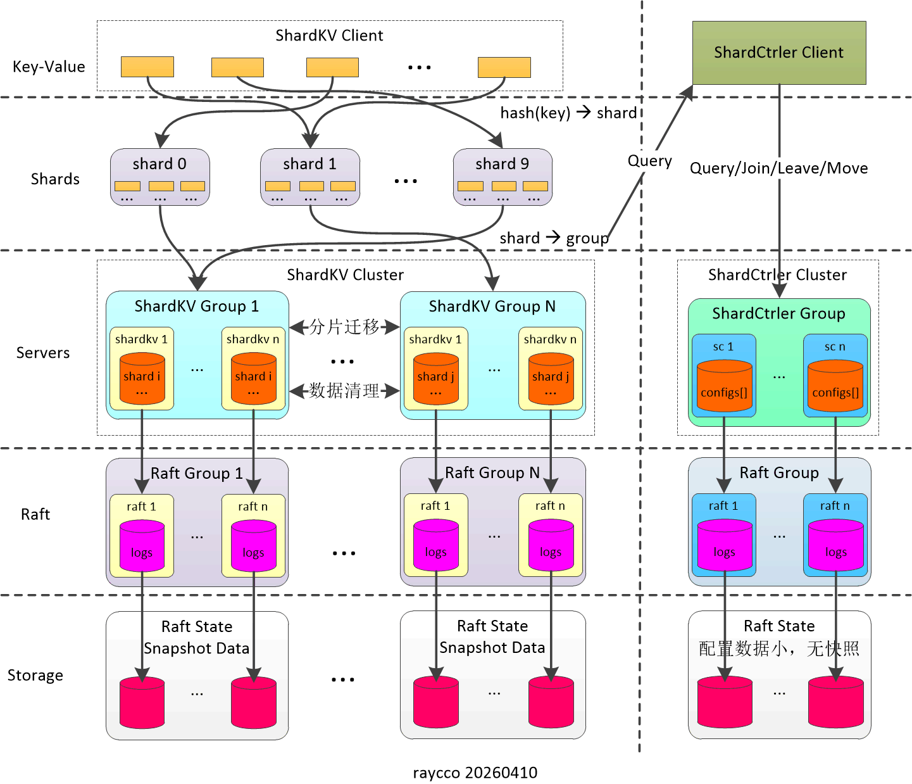
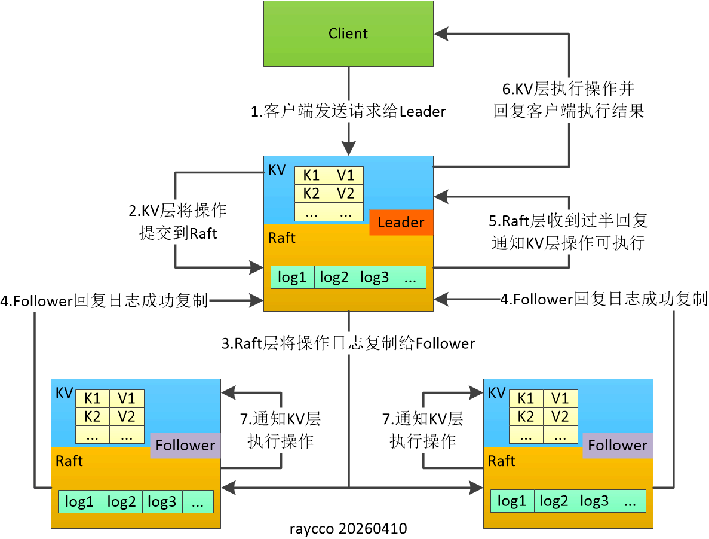
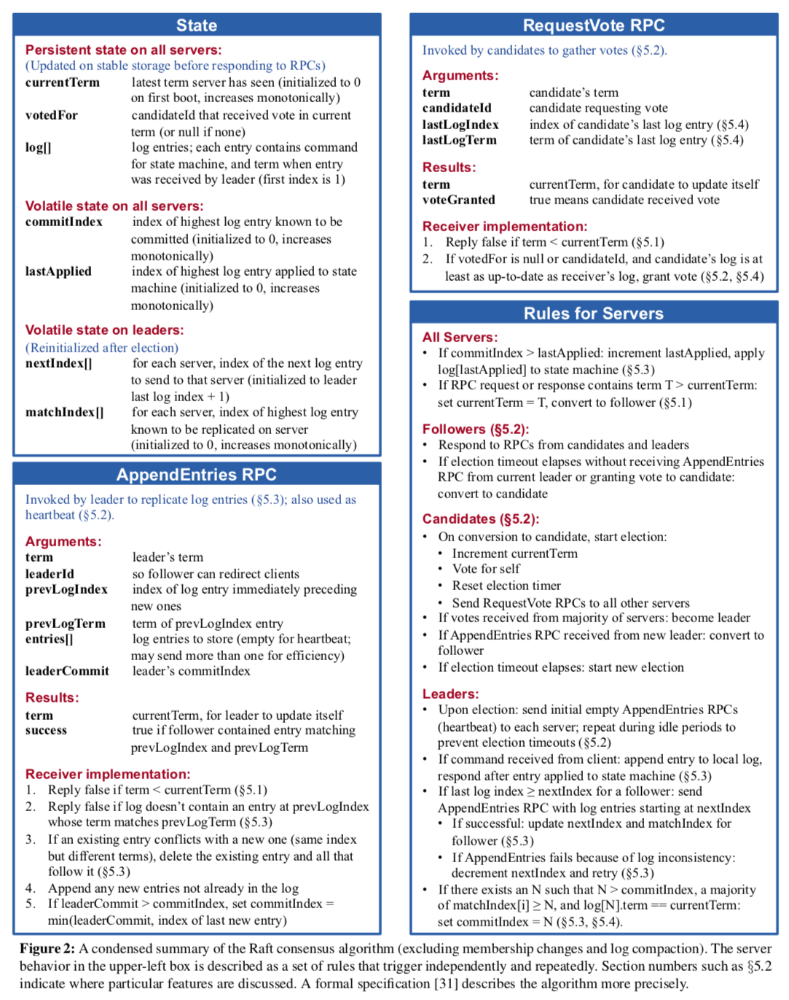

# MIT 6.824分布式系统
[MIT 6.824](http://nil.csail.mit.edu/6.824/2022/)作为分布式系统领域的经典课程，强调“从论文到代码”的完整闭环。通过研读seminal papers（如Raft共识算法、Paxos、Bigtable、Spark等）理解一致性、容错、事务等核心设计理念，再通过层层递进的编程实验（Labs），在Go语言中从零构建一套完整的、具备生产级容错能力的分布式存储系统。

## 分片键值存储（Sharded Key/Value Service）
### 组件架构
Sharded Key/Value Service系统整体架构采用**分片控制器 + 多副本组分片KV**的分布式结构，是典型的控制面 + 数据面分离架构。
<div align="center">
    
</div>

- 控制面（ShardCtrler集群）<br>
唯一的全局配置中心，负责维护一系列版本化的配置，记录所有副本组信息、分片到组的分配关系，并对外提供Join/Leave/Move/Query接口，实现集群扩缩容与分片重分配。

- 数据面（ShardKV集群）<br>
由多个独立的Raft副本组构成，每个组负责一部分分片的读写与存储。各组之间互不干扰，通过Raft保证本组内部的容错与一致性。

- 客户端交互<br>
客户端先向ShardCtrler获取最新配置，再根据Key值路由到对应副本组；若组不负责该分片，则返回重定向，保证请求被正确处理。

### 分层架构
分片键值存储（Sharded Key/Value Service）系统五层架构。
<div align="center">
    
</div>

1. **Key-Value（客户端/请求层）**<br>
    - 这一层是客户端发起的读写请求入口，对应Get/Put/Append等键值操作。
    - 核心规则：通过hash(key) → shard完成键到分片的映射：
    - 对每个请求的key做哈希计算，将其分配到固定的分片，实现数据的水平拆分。
    - 作用：把海量键值数据均匀分散到不同分片，避免单组服务器负载过高，为水平扩展打下基础。
2. **Shards（分片层）**<br>
    - 这一层是数据分片的逻辑划分层，整个键空间被切分为多个独立的分片。
    - 每个分片是一个独立的「数据单元」，内部存储对应哈希范围的所有键值对，是数据迁移、负载均衡的最小单位。
    - 核心规则：通过shard → group完成分片到Raft副本组的映射：
    - 每个分片会被分配给一个Raft副本组（Raft Group），由该组负责这个分片的所有读写服务、数据持久化和容错保障。
    - 作用：作为「键」和「副本组」的中间桥梁，实现分片的动态分配与迁移，支撑系统的弹性扩缩容。
3. **Servers（服务器/副本组层）**<br>
    - 这一层是实际承载数据的物理/逻辑服务层，由多个独立的Raft副本组组成。
    - 每个Raft副本组是一个独立的Raft集群，包含多台服务器，组内所有服务器完整复制同一个分片的全部数据。
    - 核心能力：基于Raft协议保证组内数据的强一致性、容错性：只要组内多数服务器存活，就能持续提供服务，应对节点宕机、网络分区。每个副本组仅负责自己分配到的分片，不同组并行处理请求，大幅提升系统整体吞吐量。
4. **Raft（共识算法层）**<br>
    - shardctrler集群和shardkv集群都依赖于Raft一致性协议来实现分布式日志的一致性复制。
5. **Storage（持久化存储层）**<br>
    - Raft协议的实现要求系统能够将Raft状态和日志数据持久化，以便在节点宕机或重启时恢复状态。其中由于shardctrler的配置数据比较小，所以不太需要快照功能。

## 容错键值存储（Fault-tolerant Key/Value Service）
KVServer采用"状态机复制"模式，每个节点维护一个Raft实例和一个KV数据库。客户端通过RPC与KVServer交互，所有写操作需经过Raft共识后才能应用到状态机。
<div align="center">
    
</div>

1. 客户端请请求(Put、Append和Get)发送给Leader的KV服务层；
2. Leader的KV服务层将这个Put、Append和Get命令向下发送到Raft层；
3. Raft层将操作封装成日志发送给多个Follower的Raft层；
4. Follower的Raft层复制日志后回复；
5. Leader的Raft层收到过半节点回复后, 向上发送一个通知到KV服务层可以真正执行这个操作；
6. Leader的KV服务层执行命令改变自身的状态, 并回复给客户端执行结果；
7. Follower的KV服务层也应用Raft层的日志改变自身的状态(客户端不需要等待Follower这个操作完成)。

## 共识算法实现（Raft）
要求实现Raft，这是一种复制状态机协议，用于构建一个容错的键/值存储系统。具体要求如下：
- 遵循Raft论文的设计，重点参考图2。
- 实现论文中描述的大部分功能，包括持久状态的保存和恢复，即使在节点故障和重启后也能保证数据的完整性。
- 不需要实现集群成员变更的部分（论文第六节）。

<div align="center">
    
</div>

## 附录
论文地址：
```
Raft小论文:
https://raft.github.io/raft.pdf

Raft大论文:
https://github.com/ongardie/dissertation
```

MIT 6.824地址：
```
旧地址:
http://nil.csail.mit.edu/6.824/2022/

新地址：
https://pdos.csail.mit.edu/6.824/
```